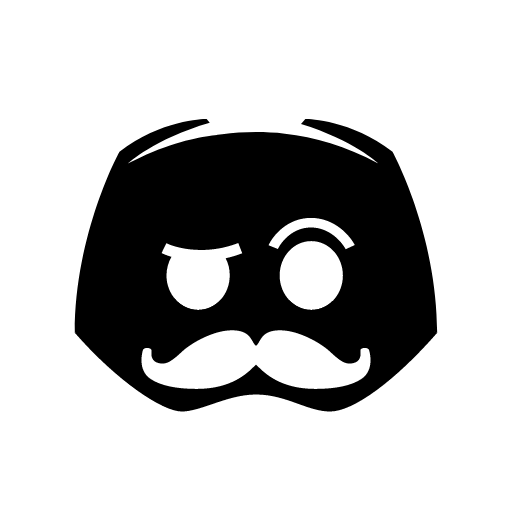

[![Contributors][contributors-shield]][contributors-url]
[![Forks][forks-shield]][forks-url]
[![Stargazers][stars-shield]][stars-url]
[![Issues][issues-shield]][issues-url]
[![MIT License][license-shield]][license-url]
[![LinkedIn][linkedin-shield]][linkedin-url]

<br />
<p align="center">
  <a href="https://github.com/albertoparras-dev/MMR_Bot">
    
  </a>

  <h3 align="center">MMR Bot</h3>

  <p align="center">
    A Discord Bot that tells your MMR.
    <br />
    <a href="https://discord.com/oauth2/authorize?client_id=850218581501542400&permissions=2148006976&scope=bot"><strong>Invite the Bot to your Server</strong></a>
    <br />
    <br />
    <a href="https://discord.gg/EsYym5p8px">Support Server</a>
    ·
    <a href="https://github.com/albertoparras-dev/MMR_Bot/issues">Report Bug</a>
    ·
    <a href="https://github.com/albertoparras-dev/MMR_Bot/issues">Request Feature</a>
  </p>
</p>

<details open="open">
  <summary>Table of Contents</summary>
  <ol>
    <li>
      <a href="#about-the-project">About The Project</a>
      <ul>
        <li><a href="#built-with">Built With</a></li>
      </ul>
    </li>
    <li>
      <a href="#getting-started">Getting Started</a>
      <ul>
        <li><a href="#prerequisites">Prerequisites</a></li>
        <li><a href="#installation">Installation</a></li>
      </ul>
    </li>
    <li><a href="#roadmap">Roadmap</a></li>
    <li><a href="#license">License</a></li>
    <li><a href="#contact">Contact</a></li>
  </ol>
</details>

## About The Project
Hello everyone and welcome to my repo!
In this repo I'll be uploading the code of the bot that I've made, MMR Bot.
You can invite it to your server with the link above, the bot is hosted in a VPS and is online 24/7.

Features:
* Uses the powerful library, Discord.js
* Gives your LoL MMR, without opening the browser for using third party pages.
* Open Source.
* I'll maintain the code and adding features for long time.

### Built With

Here is the list of things that I used to do the bot:
* [Node.js](https://nodejs.org/)
* [Discord.js](https://discord.js.org/)
* [dotenv](https://www.npmjs.com/package/dotenv)
* [node-html-markdown](https://www.npmjs.com/package/node-html-markdown)
* [superagent](https://www.npmjs.com/package/superagent)
* [WhatIsMyMMR API](https://dev.whatismymmr.com/)

## Getting Started

Step by step of things to start using my code.

### Prerequisites

Before start, we need to have installed the next.
* node
  
* npm
  ```sh
  npm install npm@latest -g
  ```

### Installation

1. Clone the repo
   ```sh
   https://github.com/albertoparras-dev/MMR_Bot.git
   ```
2. Install NPM packages
   ```sh
   npm install
   ```
4. Create a `.env` file
5. Fill the `.env` file following this template
   ```
   TOKEN = <Your Discord Bot Token Here>
   PREFIX = <Your desired Prefix>
   ```

## License

Distributed under the CC-BY License. See [this link](https://creativecommons.org/licenses/by/3.0/) for more information.

## Contact

Alberto Parras - [@albertoparrasc](https://twitter.com/albertoparrasc) - aparrasceballos@gmail.com - Friext#6935 - [Support Server](https://discord.com/api/oauth2/authorize?client_id=850218581501542400&permissions=2148006976&scope=bot)


[contributors-shield]: https://img.shields.io/github/contributors/othneildrew/Best-README-Template.svg?style=for-the-badge
[contributors-url]: https://github.com/othneildrew/Best-README-Template/graphs/contributors
[forks-shield]: https://img.shields.io/github/forks/othneildrew/Best-README-Template.svg?style=for-the-badge
[forks-url]: https://github.com/othneildrew/Best-README-Template/network/members
[stars-shield]: https://img.shields.io/github/stars/othneildrew/Best-README-Template.svg?style=for-the-badge
[stars-url]: https://github.com/othneildrew/Best-README-Template/stargazers
[issues-shield]: https://img.shields.io/github/issues/othneildrew/Best-README-Template.svg?style=for-the-badge
[issues-url]: https://github.com/othneildrew/Best-README-Template/issues
[license-shield]: https://img.shields.io/github/license/othneildrew/Best-README-Template.svg?style=for-the-badge
[license-url]: https://github.com/othneildrew/Best-README-Template/blob/master/LICENSE.txt
[linkedin-shield]: https://img.shields.io/badge/-LinkedIn-black.svg?style=for-the-badge&logo=linkedin&colorB=555
[linkedin-url]: https://linkedin.com/in/othneildrew
[product-screenshot]: images/screenshot.png
